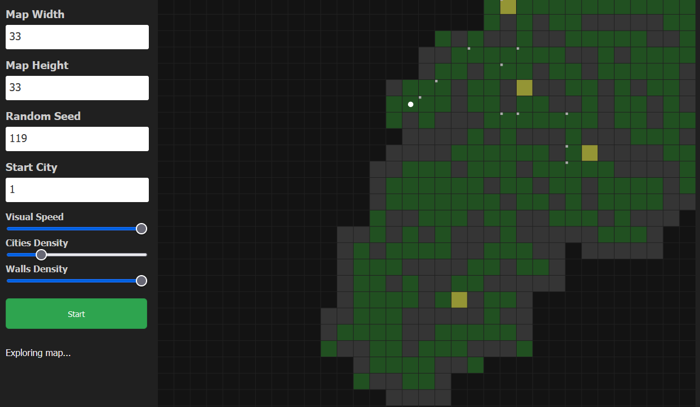
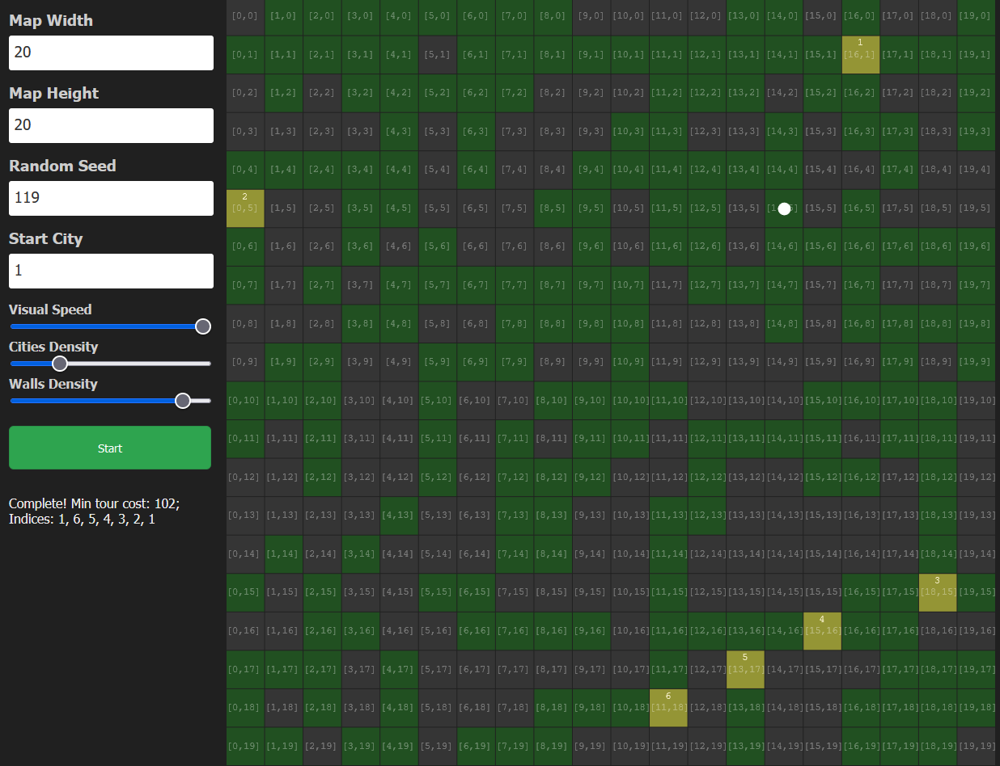
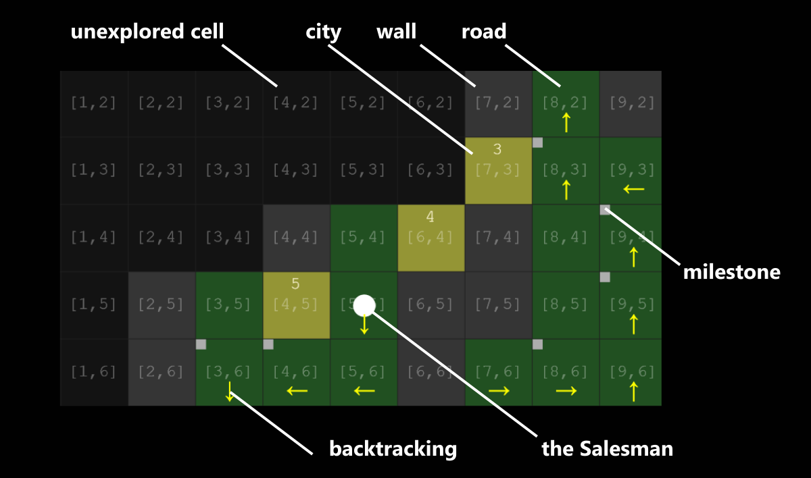
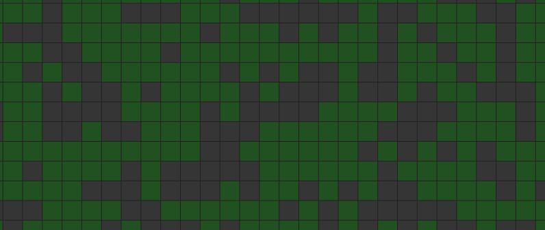

# Travelling Salesman Problem Solver

## Introduction

This project provides a visual overview of several graph algorithms, namely: Depth-First Search, Dijkstra algorithm, Minimum Spanning Tree solver, and Travelling Salesman Problem solver

You can try it out live [here](https://dodo.me/salesman/index.html)



### Task Description
- There is a random MxN map that consists of three types of cells: road, wall, city. A wall cannot be crossed.
- The Salesman starts in a random city and must first explore the map, as he/she doesn't know where the other cities are
- The Salesman can only travel one cell at a time - up, down, left, and right (not diagonally)
- The Salesman can only see the surrounding cells (including the diagonal ones)
- **Flow**
  1) The Salesman explores the map to find all cities
  2) The Salesman then returns to the city where he/she first appeared the shortest way possible
  3) The Salesman then calculates the optimal solution on how to visit each city only once and return back to the first city

### Installation
- make sure you have [NodeJS](https://nodejs.org/en/download/) installed
- install dependencies via `npm install`
- run the visual part via `npm start`
- run tests via `npm run test`
- run the performance test via `npm run performance`

### GUI
- The GUI displays the following inputs:
  - Map Width: width of the map, range 2-100
  - Map Height: height of the map, range 2-100
  - Random Seed: random seed for the map generator (should be a prime number)
  - Start City: city number where the salesman starts (range 1 - #number of cities)
  - Visual Speed: speed of the visual window
  - Cities Density: density of cities (maximum number is 22)
  - Walls Density: density of walls (maximum amount is 80% of all blocks)
- Start button will run the simulation
- **Visual Speed can be adjusted at any time**
- The webpage is responsive and should work on mobile phones too



#### Known Limitations
- the canvas always re-renders the full map, no matter what has or hasn't changed - if we'd only re-rendered the changed tiles (would need some kind of memorizer), it would speed up the visual part especially for bigger maps
- the problem, however, is the scaling -> for instance, the size of each block can be 23.13 x 23.13 (instead of 23x23) - it's better for blurring when the browser window is scaled, but it makes impossible to re-render only changed tiles (as the tiles might have shared borders)

### Flow
1. A generator will generate a random map
2. The Salesman (a white circle) will explore the map
3. Dijkstra algorithm will find the best path to the first city
4. The Salesman will walk to the first city
5. MST algorithm will generate a minimum spanning tree
6. TSP algorithm will find an optimal solution on how to visit the cities
7. The Salesman will endlessly travel between cities in an optimal way

#### Canvas
- each cell has a label with its coordinates and cities have numbers (this feature is disabled for maps where at least one size is greater than 20 cells)
- for some phases, the algorithm displays backtrace that leads to the previous milestone
- milestones are used by DFS algorithm whenever the Salesman arrives at a cell from which there are more paths



## Technical Details
#### Libraries
- TypeScript with vanilla DOM API
- CanvasAPI for rendering
- [jest](https://jestjs.io/) for testing
- node-ts for running TypeScript from NodeJS (used only for the performance test)
- [parcelJS](https://parceljs.org/) for bundling (it parses the index.html and compiles everything that is attached to it, including SASS and TS files)

#### Project Structure
```
project
│
└───docs                    // screenshots
│
└───src                     // source code
│   │
│   └───algorithms          // implementation of all algorithms
│   │
│   └───renderers           // graphical part (canvas and UI renderer)
│   │
│   └───structs             // data structures and interfaces
│   │
│   └───tests               // automated tests
│   │
│   │   index.ts            // main entry for the web app
|   |   runner.ts           // state machine that handles the whole flow
|
|   index.html              // html layout
|   jest.config             // config for jest tests
|   package.json            // npm scripts and dependencies
│   README.md               // readme
│   styles.scss             // SASS styles
│   README.md               // README file
│   tsconfig.json           // typescript config
```

#### Architecture
- architecture-wise, the project follows a hybrid object-oriented approach with functional programming where it came in handy
- **all algorithms are implemented as generators**, so that they can be easily interrupted
- the whole flow is implemented as a state machine (`runner.ts`) that can run either inside an EventLoop (implemented by `CanvasRenderer`) or during a single loop (implemented by PerformanceLooper for performance tests)
- every single state represents one part of the flow
  - for instance, `ExploreState` will initialize the algorithm, repeatedly call its generator, and return back reporting data that will be used by the `CanvasRenderer`
- `CanvasRenderer` uses a simple endless loop where it calls the state machine and collects data for rendering
- when any of those states returns `null`, the state machine will move on to the next state

## Algorithmic Details

### Helping Structures and Algorithms
- **Coord**
  - 2D coordinates
  - note that some parts use indices and some parts 2D coordinates
  - **all arrays are one-dimensional**. Therefore, the algorithms need to recalculate 2D to 1D and vice- ersa
- **Random Number Generator**
  - in `algorithms/random-generator.ts`
  - a simple Multiply-with-carry random generator. Implemented for the ability to use a random seed repeatedly
- **Priority Queue**
  - a simple FIFO queue with priorities for Dijsktra search
- **Stack**
  - a simple LIFO stack for DFS
- **State Machine**
  - a state machine with the possibility to be notified when a transition has taken place

### Random Map Generator
- in `algorithms/map-generator.ts`
- a simple map generator that tries to generate a random map with a given number of cities and walls
- it guarantees that there is a path between each two cities. However, it doesn't guarantee that all cells can be visited
- walls are more likely put nearby other walls (e.g. 78% chance if there are 3 walls nearby)

#### Known Issues
- the generator is not very good for maps with a dense amount of walls, as it spends a lot of time trying to remove some of them to make all cities visitable
- the distribution of walls still looks too random. A more natural solution would be a simplex noise, voronoi cells, and the like.




### Map Exploration
- in `algorithms/map-explorer.ts`
- uses a variation of a Depth-First Search algorithm. It basically simulates the movement of ants.
- whenever there is a cell from which there are more cells to visit, we create a "milestone" and put it onto a stack
- to speed things up, when we are going back, the milestones around which all walls have already been visited, are discarded
- works quite well for any map
- the algorithm uses two sets: visited nodes and explored nodes. If we enter a cell, all surrounding cells will be marked explored
- for exploration, we can use even diagonal cells. For movement, however, we can only go up, down, left, and right
- the order in which the neighbors are taken into consideration is important, as it dictates how the algorithm will search the map
- note: the fact that we consider even diagonal cells when exploring the neighbourhood, saves us some revisiting, yet it doesn't have very significant impact - you can try yourself in `map-explorer.ts`, instead of `currentTile.neighborsArr`, choose the `directionalNeighbors` attribute
  
#### Known Issues
- in some instances, when the map has almost been explored, there may remain a few unexplored "islands". The problem is that the algorithm doesn't know how to get to these islands, and starts backtracking until it explores the map completely
- this results in weird "dizzy" movement. A solution could be to perfrom Dijkstra or AStar on a partially explored map


### Dijkstra Search
- in `algorithms/path-finder`
- a basic implementation of Dijkstra pathfinding algorithm with a priority queue
- a heuristic function is the number of steps - to make one step, it takes `cost = 1`

#### Known Issues
- as it is a standard implementation, it always explores the full map, even if there can't be any better solution - it doesn't take into consideration the Euclidean topology of the map
- a solution would be to stop the algorithm when the current cost-so-far is the same as the Manhattan distance between both points - this could save a few iterations on very sparse maps

### Minimum Spanning Tree
- in `algorithms/mst-finder.ts`
- this algorithm uses Dijkstra to calculate the closest path from each city to all other cities
- the output of this algorithm is a list of spanning trees for all cities that can be further used by TSP Solver

### Travelling Salesman Problem Solver
- in `algorithms/tsp-solver.ts`
- an NP-complete problem solver that consumes an enormous amount of memory and takes ages to complete
- we used dynamic programming with some recursive relation of sub-problems
  - for `n` cities, there are `O(n * 2^n)` subproblems
  - the total complexity is `O(n^2 * 2^n)` which is really terrible, but still better than `O(n!)`
- to make the implementation as fast as possible, **the algorithm uses bit masks and sparse arrays** to memorize the subproblems. There are no 2D coordinates, only an array of permutations stored in bit masks

#### Known Limitations
- even with dynamic programming, it is insanely slow (see the performance test below)
- since it uses a bit array, the theoretical maximum number of cities is 64, yet with a common setup (2GB memory and i7 CPU), you will hardly go past 25 cities
- the current algorithm expects that a minimal path from city A to city B can be different than the path from B to A, which is not our case. Therefore, it could have run a bit faster if this was taken out
- **note: the visual part can be sped up significantly**, if you move the `yield` operator in `tsp-solver.ts` to the parent loop. It won't look that visually pleasing, but for cities > 15, it will speed up the run by 50%!

## Tests
### Automated tests
- all algorithms and data structures have a few tests in the `tests` folder

### Performance Testing

- there are two main bottlenecks: map generator (rationale are described above) and TSP (of course)
- all tests were conducted without the visual layout, on Intel Core i7-6800K 3.40 GHz, 6 Cores
- **note that the visual part runs significantly slower, as it has to render the data**

#### Common Variations
- Dijkstra that searches for the way back and the MST generator didn't have any significant contributions to the total time
- the following table displays the runs for various configurations of the map size, cities and walls 
- map generator seems to take the most time, yet since its complexity is not exponential, TSP takes over when the number of cities exceeds 15
- a reasonable configuration seems to be `mapSize ~ 20 x 20` with up to 50% walls and 15 cities - here the report shows varying results, probably due to certain bias that was introduced by randomness


| Map Size   |   Cities (num)      |  Walls  | Generator / explore / TSP / total (ms) |
|----------|:-------------:|:-------------:|------:|
| 5x5 |  2 | 0 | 5 / 1 / 1 / 10 |
| 5x5 |  2 | 10 | 2 / 1 / 1 / 5 |
| 5x5 |  2 | 20 | 5 / 1 / 1 / 10 |
| 5x5 |  3 | 0 | 0 / 3 / 1 / 5 |
| 5x5 |  3 | 10 | 1 / 3 / 5 / 10 |
| 5x5 |  3 | 20 | 0 / 0 / 1 / 1 |
| 5x5 |  4 | 0 | 0 / 0 / 2 / 3 |
| 5x5 |  4 | 10 | 0 / 0 / 1 / 1 |
| 5x5 |  4 | 20 | 1 / 0 / 1 / 3 |
| 10x10 |  3 | 0 | 1 / 1 / 0 / 3 |
| 10x10 |  3 | 40 | 2 / 0 / 0 / 3 |
| 10x10 |  3 | 80 | 10 / 0 / 0 / 12 |
| 10x10 |  5 | 0 | 1 / 0 / 0 / 3 |
| 10x10 |  5 | 40 | 2 / 0 / 0 / 4 |
| 10x10 |  5 | 80 | 7 / 0 / 0 / 8 |
| 10x10 |  7 | 0 | 1 / 1 / 0 / 3 |
| 10x10 |  7 | 40 | 2 / 2 / 1 / 5 |
| 10x10 |  7 | 80 | 8 / 0 / 2 / 10 |
| 20x20 |  5 | 0 | 4 / 2 / 1 / 10 |
| 20x20 |  5 | 160 | 27 / 1 / 1 / 30 |
| 20x20 |  5 | 320 | 145 / 1 / 2 / 157 |
| 20x20 |  9 | 0 | 2 / 3 / 2 / 10 |
| 20x20 |  9 | 160 | 27 / 1 / 3 / 32 |
| 20x20 |  9 | 320 | 72 / 0 / 1 / 75 |
| 20x20 |  13 | 0 | 2 / 5 / 26 / 50 |
| 20x20 |  13 | 160 | 27 / 1 / 14 / 43 |
| 20x20 |  13 | 320 | 105 / 1 / 17 / 125 |
| 30x30 |  7 | 0 | 6 / 12 / 3 / 27 |
| 30x30 |  7 | 360 | 104 / 5 / 2 / 127 |
| 30x30 |  7 | 720 | 484 / 4 / 2 / 492 |
| 30x30 |  13 | 0 | 7 / 10 / 19 / 43 |
| 30x30 |  13 | 360 | 107 / 1 / 17 / 131 |
| 30x30 |  13 | 720 | 488 / 1 / 19 / 513 |
| 30x30 |  19 | 0 | 8 / 10 / 2587 / 2615 |
| 30x30 |  19 | 360 | 120 / 4 / 2501 / 2630 |
| 30x30 |  19 | 720 | 535 / 2 / 2520 / 3061 |

#### TSP test
- there seems to be a boundary after which the complexity explodes - in this case it's around 18 cities
- note that **TSP doesn't work with the whole map, only with cities**. Therefore, the number of walls doesn't have any significancy to the test.

```
Configuration:
Map size: 30x30
Cities:   variable
Walls:    0
```

| Cities   |      Time (ms)      |  Heap (MB) |
|----------|:-------------:|------:|
| 3 |  4 | 136 |
| 4 |  4 | 144 |
| 5|  4 | 135 |
| 6 |  4 | 136 |
| 7 |  4 | 140 |
| 8 |  6 | 137 |
| 9 |  6 | 133 |
| 10 |  10 | 149 |
| 11 |  15 | 146 |
| 12 |  15 | 140 |
| 13 |  19 | 147 |
| 14 |  39 | 154 |
| 15 |  88 | 154 |
| 16 |  186 | 148 |
| 17 | 430 | 157 |
| 18 | 1175 | 213 |
| 19 |  2546 | 353 |
| 20 |  6153 | 389 |
| 21 | 15540 | 986 |
| 22 | 36532 | 2322 |

#### Map Generator test
- the generator seems to have problems with dense maps, as it needs a lot more iterations to find a proper spot for the remaining walls
- the complexity, however, seems to be linear up to 90% wall density. From 90% onward, it becomes quadratic.  

```
Configuration:
Map size: 100x100
Cities:   2
Walls:    variable
```

| Walls   |      Time (ms)      |  Heap (MB) |
|----------|:-------------:|------:|
| 0 |  155 | 136 |
| 400 |  1427 | 169 |
| 800  |  2528 | 181 |
| 1200 | 3769  | 198 |
| 1600 |  5050 | 156 |
| 2000 |  6875 | 172 |
| 2400 |  7487 | 199 |
| 2800 |  8986 | 219 |
| 3200 |  10158 | 235 |
| 3600 |  11348 | 258 |
| 4000 |  12832 | 276 |
| 4400 |  16202 | 146 |
| 4800 |  26458 | 376 |
| 5200 |  23091 | 521 |
| 5600 | 24151 | 427 |
| 6000 | 29071 | 521 |
